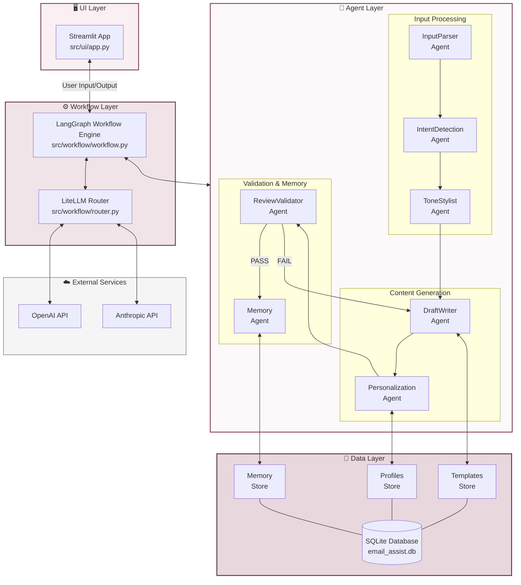
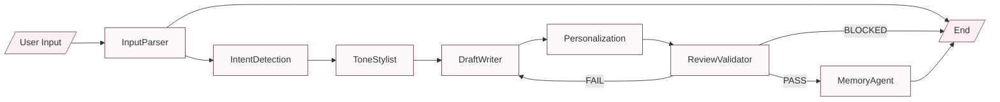
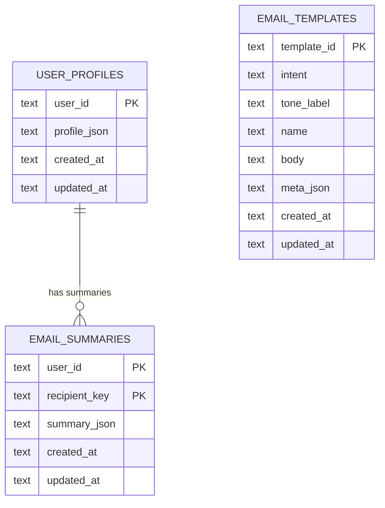

# EMaiL Assist


Email Assist is a multi-agent, LangGraph-powered AI email assistant that parses intent,
applies tone, drafts emails using templates, validates output, and maintains lightweight
memory across interactions.

This was done as a capstone project for the Interview Kickstart Agentic AI course.

## Quickstart

### Requirements
- Python 3.12+
- OPENAI_API_KEY
- ANTHROPIC_API_KEY (optional fallback)
- SECRET_SALT

### Run locally
```bash
./start.sh
```

### Run with Docker
```bash
docker compose up --build
```

### Test
```bash
pytest -v
```

## Architecture

### System Architecture



### Agent Workflow (StateGraph)

Built with LangGraph.



### Data Model

#### data/email_assist.db (sqlite)



#### LangGraph Memory
Session based memory uses LangGraph checkpointer MemorySaver with thread_id tied to the session_id.

session_id is computed as a hash of the user_id + salt (SECRET_SALT env var).

### Agents

| Agent | Responsibility |
|-------|----------------|
| **InputParsingAgent** | Extracts structured fields from raw user input (recipient, subject hints, key points) |
| **IntentDetectionAgent** | Classifies email intent (outreach, follow_up, apology, request, etc.) |
| **ToneStylistAgent** | Determines or refines tone (formal, friendly, assertive, apologetic, concise) |
| **DraftWriterAgent** | Generates email draft using templates and LLM |
| **PersonalizationAgent** | Injects user profile data and recipient context |
| **ReviewValidatorAgent** | Validates draft quality, returns PASS/FAIL/BLOCKED |
| **MemoryAgent** | Persists interaction context for future reference |

### Directory Structure
```
email_assist/
├── README.md
├── LICENSE
├── Dockerfile
├── docker-compose.yml
├── .dockerignore
├── .gitignore
├── .gitattributes
├── start.sh
├── data/
│   └── email_assist.db          # SQLite DB (created at runtime)
├── src/
│   ├── ui/
│   │   └── app.py                # Streamlit UI
│   ├── workflow/
│   │   ├── workflow.py           # LangGraph StateGraph definition and app entry-point
│   │   └── router.py             # LiteLLM / MCP model router
│   ├── agents/
│   │   ├── base_agent.py
│   │   ├── state.py              # AgentState for the StateGraph
│   │   ├── response.py           # AgentResponse for agent.run() return type
│   │   ├── input_parser_agent.py
│   │   ├── intent_detection_agent.py
│   │   ├── tone_stylist_agent.py
│   │   ├── draft_writer_agent.py
│   │   ├── personalization_agent.py
│   │   ├── review_validator_agent.py
│   │   └── memory_agent.py
│   ├── memory/
│   │   └── sqlite_memory_store.py
│   ├── templates/
│   │   ├── fixtures/
│   │   │   └── templates.py      # Templates to initially populate the data store
│   │   ├── seed_templates.py
│   │   └── seed_templates_store.py
│   ├── profiles/
│   │   ├── seed_profile.py
│   │   ├── profile_store.py
│   │   └── sqlite_profile_store.py
│   └── utils/
│       ├── logging.py            # Colored logging + ECID
│       ├── sessionid.py          # Session ID helpers
│       └── recipient.py          # normalize_recipient / compute_recipient_key
├── tests/
│   ├── test_input_parser.py
│   ├── test_intent_detection.py
│   ├── test_tone_stylist.py
│   ├── test_draft_writer.py
│   ├── test_review_validator.py
│   ├── test_personalization.py
│   ├── test_memory_agent.py
│   └── utils/
│       └── mock_llm.py           
├── pyproject.toml
└── requirements.txt
```

## Contributing
This was done as a capstone project for the Interview Kickstart Agentic AI course. I'm not likely to be maintaining this going forward, but if you feel strongly you'd like to improve this, do the following:

1. Fork the repo
2. Create a feature branch
3. Add tests for any new behavior
4. Ensure `pytest` passes
5. Open a PR with a clear description

Code style favors clarity over cleverness.

## License
MIT